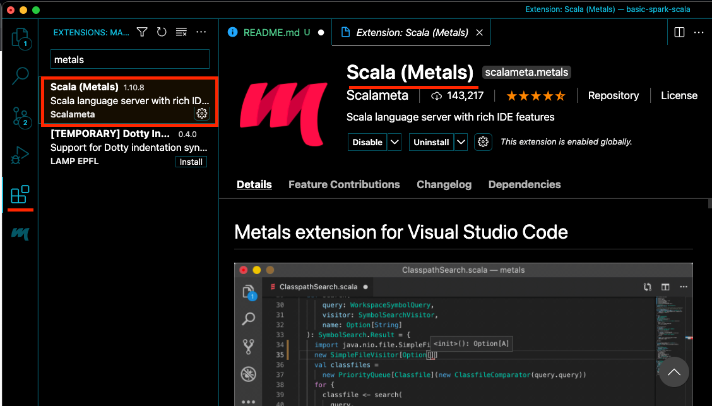

# Requirements

* Install Java JDK 11 [Install here](https://adoptopenjdk.net/)
* Install Scala 2 [Install here](https://www.scala-lang.org/download/scala2.html)
* Install SBT [Install here](https://www.scala-sbt.org/download.html)
* Download Spark (3.1.2) [Download here](https://spark.apache.org/downloads.html)

<br>

# Configure spark

### Mac OS
1. Extract the spark folder spark-3.1.2-bin-hadoop3.2.tgz
```sh
tar -xfz ./spark-3.1.2-bin-hadoop3.2.tgz
```

3. Create folder ~/spark
```sh
mkdir ~/spark
```

4. Move the spark folder
```sh
$ mv ./spark-3.1.2-bin-hadoop3.2 ~/spark/spark-3.1.2
```

5. Add export variables and update the path using ZSH profile (Replace "{Your User}" to your user in OS)
```sh
$ echo '\nexport JAVA_HOME=$(/usr/libexec/java_home)' >> ~/.zshrc
$ echo 'export SPARK_HOME="/Users/{Your User}/spark/spark-3.1.2"' >> ~/.zshrc
$ echo 'export PATH="$SPARK_HOME/bin:$PATH"\n' >> ~/.zshrc
```

<br>

# Environments

### Visual Studio Code

[Link to download and Install](https://code.visualstudio.com/)

1. Install the Scala metals extension
